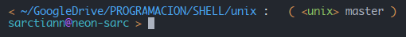

# Una configuración sencilla de _ZSH_

> para lograr este perfil utilizo 2 plugins de `zsh-users`:
>
> - [zsh-syntax-highlighting](https://github.com/zsh-users/zsh-syntax-highlighting)
> - [zsh-autosuggestions](https://github.com/zsh-users/zsh-autosuggestions)

Utilizo esta configuración sin cambios significativos hace ya mucho tiempo,
ya que satisface todos los requerimentos que tengo para utilizar cómodamente el
Terminal.

Aquí una pequeña muestra:

En sintesis, cuenta con resaltado de texto, sugerencias, información de git, y un
estilo diferente para los entornos virtuales de python.

---

## Instrucciones

### para instalar zsh, configurar sarc style, y agregar un par de plugins

---

1. Para simplificar las cosas, primero Abrir un Terminal situado en esta carpeta

1. Instalar zsh si aún no lo tenés en el sistema:

   `sudo apt install zsh`

1. Configurar zsh como shell por defecto en el profile del emulador de terminal:

   `which zsh` nos devuelve el path de **zsh** que necesitamos para reemplazar
   **/bin/bash** o **/usr/bin/bash**

   > no usar: `chsh -s $(which zsh)` porque necesitamos que el sistema siga usando
   > su shell por defecto

1. Copiar el archivo **.zshrc** de esta carpeta y reemplazamos el que nos creo
   zsh en nuestro _home_:

   1. Hacer un backup de .zshrc por si algo va mal:

      `cp  ~/.zshrc ~/.zshrc_old`

   1. Ahora si:

      (Linux) `cp ./linux/.zshrc ~/`

      (Mac) `cp ./mac/.zshrc ~/`

1. Copiar la carpeta **.zsh** en nuesto _home_:

   `cp -r ./.zsh ~/`

1. (Solo en Linux) Copiar el archivo **prompt_sarc_setup** en: /usr/share/zsh/functions/Prompts/

   `sudo cp ./prompt_sarc_setup /usr/share/zsh/functions/Prompts/`

   _(y ponemos nuestra contraseña)_

1. Solo queda cerrar y volver a abrir el terminal

   `exit` y posiblemente **[CTRL]** + **[SHIFT]** + **[T]** para abrir ;)

### Listo

Podría haber condensado esto en un sript jaja. Pero que gracia tendría.

---
