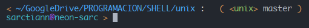

<!-- 
    Español (Spanish)

    Este es un archivo de markdown, podés verlo correctamente, en VSCode
    presionando las teclas: CTRL + SHIFT + V
-->

# Una configuración sencilla de *ZSH*

> para lograr este perfil utilizo 2 plugins de `zsh-users`:
> * [zsh-syntax-highlighting](https://github.com/zsh-users/zsh-syntax-highlighting)
> * [zsh-autosuggestions](https://github.com/zsh-users/zsh-autosuggestions)

En mi caso, es todo lo que necesito por el momento para utilizar con comodidad
el Terminal. Pero para otros podría servirles de pequeña muestra de lo que se
puedo lograr con ***zsh***

El resultado se ve así:

y cuenta con resaltado de texto, sugerencias e información de git

---

# Instrucciones

### para instalar zsh, configurar sarc style, y agregar un par de plugins

---

1. Para simplificar las cosas, primero Abrir un Terminal situado en esta carpeta

1. Instalar zsh si aún no lo tenés en el sistema:

    `sudo apt install zsh`

1. Configurar zsh como shell por defecto en el profile del emulador de terminal:

    `which zsh` nos devuelve el path de **zsh** que necesitamos para reemplazar **/bin/bash** o **/usr/bin/bash**
    
    > no usar: `chsh -s $(which zsh)` porque necesitamos que el sistema siga usando su shell por defecto

1. Copiar el archivo **.zshrc** de esta carpeta y reemplazamos el que nos creo 
    zsh en nuestro *home*:

    1. Hacer un backup de .zshrc por si algo va mal:

        `cp  ~/.zshrc ~/.zshrc_old`

    1. Ahora si:

        `cp ./.zshrc ~/`

1. Copiar el la carpeta **.zsh** en nuesto *home*:

    `cp -r ./.zsh ~/`

1. Copiar el archivo **prompt_sarc_setup** en: /usr/share/zsh/functions/Prompts/

    `sudo cp ./prompt_sarc_setup /usr/share/zsh/functions/Prompts/`

    *(y ponemos nuestra contraseña)*

1. Solo queda cerrar y volver a abrir el terminal 

    `exit` y posiblemente **[CTRL]** + **[SHIFT]** + **[T]** para abrir ;)

### Listo!

Podría haber condensado esto en un sript jaja. Pero que gracia tendría.
Si esa es Su idea debería probar **fish** (*friendly interactive shell*)

---